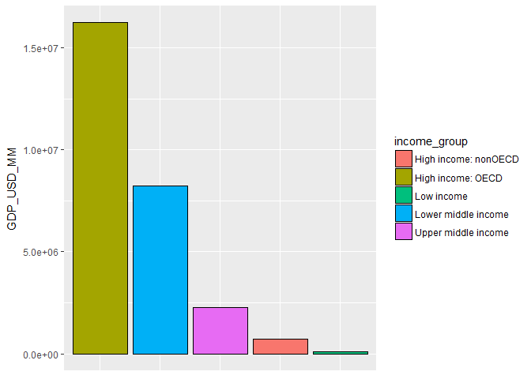
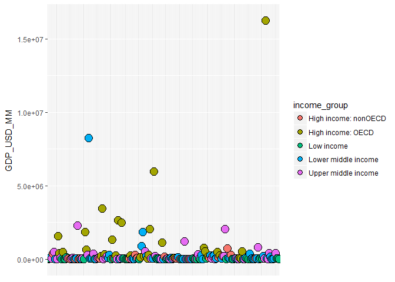

# Case Study 1 Write Up
Sam Coyne  
March 20, 2017

# Introduction

This analysis details the steps performed to analyze two economic data sets published by the World Bank for the year 2012. The goal of this analysis is to develop a tidy data set appropriate for a macroeconomic analysis. Specifically, this analysis will begin to ask if a given country’s GDP is a good indicator of income group and vice versa. There are two data sources from the World Bank. The first data set (GDP) can be downloaded from either of these sites:

[https://d396qusza40orc.cloudfront.net/getdata%2Fdata%2FGDP.csv]

[http://data.worldbank.org/data-catalog/GDP-ranking-table]

The second data set (educational) can be downloaded from either of these sites:

[https://d396qusza40orc.cloudfront.net/getdata%2Fdata%2FEDSTATS_Country.csv]

[http://data.worldbank.org/data-catalog/ed-stats]

If replicating this study, be aware both data sets need to be cleaned. Also, it should be noted, the educational data set contains many more variables than we will use in this analysis. For a complete list of variables removed, please consult with the README in the Github repository.  

*Headers are easily located in the Education data set, but be aware the GDP will require one to skip the first five lines before reading headers.

*Both data sets are delimited by a comma (CSV)

*The final and tidy data set consists of the following variables:

1. country code: a three-letter code to designate a certain country. See also: country name.

2. ranking: a simple numerical ranking (1-190) of GDP

3. GDP_USD_MM: a given country's GDP (gross domestic product) measured in USD ($) MM

4. country_name: a given country's full name

5. income_group: a classification variable assigned by the World Bank

6. geographic_region: geographic_region: character value giving the reader more description if unfamiliar with a country's geography

7. quantile: a simple rating (1-5) of GDP rank. There are 190 possible GDP ranks. As such, each quantile has 38 countries. Every country in a certain quantile is     assigned the same quantile score.

# Problems with this data set:

1. There are some unique identifiers that are not a country. For example, “low income” has a three-letter code of LIC. Such codes may be mistaken for a country on the first pass of an analysis. Please refer to all data cleansing steps in the clean_and_merge R script found in the Github repository.  

2. Many variables are not complete, with many holes in observations. While such variables may have significance in other analyses, they were removed from this analysis.

3. Some countries are missing GDP values. As such, they will be excluded from this analysis. The following countries do not have a reported GDP in this data set: American Samoa (ASM), Andorra (ADO), Cayman Islands (CYM), Channel Islands (CHI), Curacao (CUW), Djibouti (DJI), Faeroe Islands (FRO), French Polynesia (PYF), Greenland (GRL), Guam (GUM), Isle of Man (IMY), Democratic People’s Republic of Korea (PRK), Libya (LBY), Liechtenstein (LIE), Myanmar (MMR), New Caledonia (NCL), Northern Mariana Islands (MNP), San Marino (SMR), Sint Maarten (SXM-Dutch Part), Somalia (SOM), St. Martin (French Part-MAF), Turks and Caicos Islands (TCA), Virgin Islands-U.S. (VIR), West Bank and Gaza (WBG).  

# Glossary of Terms
GDP = Gross Domestic Product, "GDP is the monetary value of all the finished goods and services produced within a country's borders in a specified time" (Investopedia.com/terms/g/gdp.asp)

OECD = The Organization for Economic Co-Operation and Development: "The mission...is to promote policies that will improve the economic and social well-being of people around the world" (oecd.org/about).

Raw data = The data as obtained from the World Bank. No cleaning or manipulation steps have been taken. Interested readers are encouraged to seek meaningful insight from other variables found in the raw data files. See the README for a full description of available variables. 

# Files for Analysis:

1. README: a thesis statement followed by final a description of all variables.

2. raw_data: csv files from the World Bank sites. The clean and merge script will download the files to your working directory. These files should be considered a backup in case the links no longer work 

3. download_packages_and_data: this R script will download ggplot2 and downloader. These packages will be used in the visualization section of this analysis. This script also downloads the raw data to your working directory. If these links no longer work, please pull the CSV files in the repository (raw_data).

4. clean_and_merge: this R script cleans the raw data files, removes superfluous variables, merges, sorts, removes any NA values, and writes a tidy CSV file to one’s working directory. See further work below for why this may be useful (i.e. more visualization). If interested in the data cleaning process, please reference this script.

5. analysis-This R script completes the analysis on the combined data set. This script will complete the following analyses.

6. main: this R script acts as the “master script” that runs the three needed scripts (download_packages_and_data, clean_and_merge, and analysis)

    *Specifically, this script will look at differences in average ranks for OECD vs. nonOECD countries

    *all visualizations
  
    *quantile analysis based on GDP ranks

# Directions to Run the Code
The R script, main.R, will run three separate R scripts: download_packages_and_data, clean_and_merge, and analysis. If the user has specific questions relating to data cleaning, please review the script clean_and_merge. Likewise, the same is true for analysis. If the user does not need to download ggplot2 or downloader, comment these commands out with hashtag x 2. Also, if the World Bank URL's are not working properly, store the raw data files in the proper directory and proceed with running the analysis. The end user should also be aware the final tidy data set will be written to the working directory upon completion of the script. This is intended for users who wish to do additional analysis or make more visualizations. When the user runs main.R, the files written to the working directory are as follows:

GDP file name (raw data only): getdata_data_GDP

Education file name (raw data only): getdata_data_EDSTATS_Country

To source the main.R script, please use the following command. 

```r
source("./main.R")
```

# Analysis
One area of interest in this analysis is analyzing the differences in economic performance of countries that are classified as OECD versus those that are classified as nonOECD. This analysis approaches that problem by first looking at those exact differences: OECD vs. nonOECD. To keep classifications consistent, we will use the same income group, high income.


```r
#make a new object for incomes equal only to: High income: OECD and High income: nonOECD
rich <-  combined_data_final_sorted_filtered[combined_data_final_sorted_filtered$income_group %in% c("High income: OECD","High income: nonOECD"), ]

#calculate the mean rank of these countries
rich_ranks <- rich$ranking
mean(rich_ranks)
```

```
## [1] 58.54717
```

The first analysis is surprising: High Income: OECD and High income: nonOECD have a higher mean GDP ranking than hypothesized. The combined average of 58.55 likely indicates there is some skewness in these data sets. To get a better understanding of mean ranks, separation of the two classifications reveals there is a significant difference between the two groups.


```r
#make a new object for income equal to: High income: OECD
rich_OECD <-  combined_data_final_sorted_filtered[combined_data_final_sorted_filtered$income_group %in% ("High income: OECD"), ]

#calculate the mean rank of these high income OECD countries
OECD_ranks <- rich_OECD$ranking
mean(OECD_ranks)
```

```
## [1] 32.96667
```

```r
#make a new object for incomes equal only to High income: nonOECD
high_income_nonOECD <-  combined_data_final_sorted_filtered[combined_data_final_sorted_filtered$income_group %in% ("High income: nonOECD"), ]

#calculate mean rank of the high income nonOECD group
high_income_rank <- high_income_nonOECD$ranking
mean(high_income_rank)
```

```
## [1] 91.91304
```

The mean GDP rank of High income: OECD is 32.97. Compare that to the average GDP rank of High income: nonOECD countries, 91.91. This analysis tells us that OECD membership seems to have a remarkable impact on GDP ranking (in USD MM). While there are some decent GDP rankings for countries not involved with the OECD, there appears to be a strong relationship between membership and economic performance, as measured in GDP.

This visualization tells us the high income: OECD group far exceeds other income groups. On the other hand, having a high-income classification without OECD membership does not result in a high GDP. This suggests, but does not prove, the OECD membership is a driving force behind a superb GDP figure

<!-- -->

This visualization reinforces the above claim. The countries that perform best, in terms of gross domestic product, are members of the OECD. Those countries that “break away” from the masses are mostly OECD members.

<!-- -->

The final segment of the analysis creates a quantile variable of the 190 countries with a GDP rank.

```r
#create quantile variable
attach(combined_data_final_sorted_filtered)
combined_data_final_sorted_filtered$quantile[ranking <= 38] <- 1
combined_data_final_sorted_filtered$quantile[ranking >= 39 & ranking <= 76] <- 2
combined_data_final_sorted_filtered$quantile[ranking >= 77 & ranking <= 114] <- 3
combined_data_final_sorted_filtered$quantile[ranking >= 115 & ranking <= 152] <- 4
combined_data_final_sorted_filtered$quantile[ranking >= 153 & ranking <= 190] <- 5
detach(combined_data_final_sorted_filtered)

#subset data for quantile 1
top_quantile <- subset(combined_data_final_sorted_filtered, quantile==1)

#make a table out of quantile 1 data
count_quantile_1 <- table(top_quantile$income_group, top_quantile$ranking)

#do a count of rows in quantile 1
rowSums(count_quantile_1)
```

```
## High income: nonOECD    High income: OECD  Lower middle income 
##                    4                   18                    5 
##  Upper middle income 
##                   11
```

As one can see, the quantiles are evenly distributed with 38 countries appearing in each quantile. A table calculation reveals that there are only five lower middle income countries in quantile one. Not surprisingly, High Income: OECD countries still lead the count in this analysis with 18 of the top rank positions, or 47.37%.

# Conclusion
From the above plots and analysis, it appears the Organization for Economic Cooperation and Development (OECD), is a strong indicator of GDP performance. The organization’s purpose, “the governments of 34 democracies with market economies work with each other, as well as with more than 70 non-member economies to promote economic growth, prosperity, and sustainable development” (usoecd.ucmission.gov/mission/overview/html) is consistent with the above findings. Although GDP is not the only indicator of economic health, it is certainly a crucial part in overall health. According to the OECD, members “account for 63% of world GDP, three-quarters of world trade, and 95 percent of world official development assistance…” ( usoecd.ucmission.gov/mission/overview/html). As observed in the above analysis, 18 out of the 38 first quartile countries are classified as “High income: OECD” in terms of income group. This is possibly due to the sharing of best practices in economic development the organization promotes. By encouraging collaboration and knowledge sharing, the OECD appears have a positive impact on a country’s GDP performance. 


# Further Work
This analysis clarifies the relationship between OECD status and gross domestic product. To expand upon this work, it is recommended one pull in additional years from the World Bank. This time series approach would reveal macroeconomic trends in OECD countries versus nonOECD countries. Another idea for additional research is to subset the raw data by geographic regions and complete “region specific” analyses. This subset approach may help answer any geographic specific questions. Suggested R packages for the above suggested analyses are zoo and ggmap. More information on those packages can be found here: 

[https://cran.rproject.org/web/packages/ggmap/index.html]

[https://cran.r-project.org/web/packages/zoo/index.html]

A final tidy data set is written to the user’s working directory. This may be useful if one has access to visualization software such as Tableau and would like to graphically explore more aspects of this data set. 

# Appendix-Questions and Answers to Case Study with Full Code
1. Merge the data based on the country shortcode. How many of the IDs match? 

You can find this code in the clean_and_merge R script. 

```r
#this step merges the data set after basic data cleaning by the "country_code" variable.

combined_data <- merge(gdp_clean_final, educ_clean_final, by="country_code", all=TRUE)

#this calculation will count the number of NA's in this data frame.
sum(is.na(combined_data))
```

```
## [1] 66
```

```r
#This code tells us all NA’s found. By conducting a closer inspection of variables

#The result is a total of 66 NA's in our data set.

#However, we need to look at each variable to understand where the NAs are originating.
#sum(is.na(combined_data$country_code))
#sum(is.na(combined_data$ranking))
sum(is.na(combined_data$economy))
```

```
## [1] 21
```

```r
#sum(is.na(combined_data$GDP_USD_MM))
#sum(is.na(combined_data$country_name))
#sum(is.na(combined_data$income_group))
#sum(is.na(combined_data$geographic_region))
```

The above tells us that 21 NAs are found in neighboring columns/variables: ranking, economy, and GDP.  
There are 211 countries in the resulting data frame 21 countries do not match on country code and 190 match on country code. The above code is not executed due to length. The purpose is to demonstrate a useful script to check variables for NA's.

The below code is not executed due to length. However, use this R code to see a list of countries that do not match.

combined_data[is.na(combined_data$economy),]

2. Sort the data frame in ascending order by GDP (so United States is last). What is the 13th country in the resulting data frame?

You can find this code in the clean_and_merge R script. 

```r
#sort in ascending order
attach(combined_data_final)
combined_data_final_sorted <- combined_data_final[order(GDP_USD_MM),]
detach(combined_data_final)

#Need to look at the remaining NA's. This logical function tells us the NA's will be found at the bottom of the data frame since we have sorted ascending.
look_at_all_na <- apply(combined_data_final_sorted, 1, function(x){any(is.na(x))})

#make an object to filter out the NA's
combined_data_final_sorted_filtered <- combined_data_final_sorted[!look_at_all_na,]
```

We find the 13th country in the resulting data frame to be St. Kitts and Nevis ($767MM GDP) tied with Grenada.

The relatively low GDP of Saint Kitts and Nevis is “likely due to the declining state-owned sugar company…” as well as "S. Kitts is dependent upon tourism to drive #its economy" (https://en.wikipedia.org/wiki/Saint_Kitts).


3. What are the average GDP rankings for the "High income: OECD" and "High income: nonOECD" groups?

You can find this code in the analysis R script.

```r
#make a new object for incomes combining high income OECD and non OECD.

rich <-  combined_data_final_sorted_filtered[combined_data_final_sorted_filtered$income_group %in% c("High income: OECD","High income: nonOECD"), ]

#calculate the mean rank of these countries
rich_ranks <- rich$ranking
mean(rich_ranks)
```

```
## [1] 58.54717
```

```r
#make a new object for incomes containing only: "High income: OECD"
rich_OECD <-  combined_data_final_sorted_filtered[combined_data_final_sorted_filtered$income_group %in% ("High income: OECD"), ]

#calculate the mean rank of these high income OECD countries
OECD_ranks <- rich_OECD$ranking
mean(OECD_ranks)
```

```
## [1] 32.96667
```

```r
#make a new object containing only "High income: nonOECD"
high_income_nonOECD <-  combined_data_final_sorted_filtered[combined_data_final_sorted_filtered$income_group %in% ("High income: nonOECD"), ]

#calculate mean rank of high income nonOECD
high_income_rank <- high_income_nonOECD$ranking
mean(high_income_rank)
```

```
## [1] 91.91304
```

This analysis tells us the OECD membership seems to have a remarkable impact on GDP ranking (in USD MM). While there are some decent rankings for countries not involved with the OECD, there appears to be a strong relationship between membership and economic performance, as measured in GDP. One possible reason is “(the) OECD uses its wealth of information on a broad range of topics to help governments foster prosperity and fight poverty through economic growth and financial stability…help ensure the environmental implications of economic and social development are taken into account” (http://www.oecd.org/about/whatwedoandhow/).

The mean difference in ranks is significant. The next section will reinforce this concept with visualizations.

4. Plot the GDP for all of the countries. Use ggplot2 to color your plot by Income Group

As both plots tell us, higher GDP figures are associated with OECD membership and a high income classification. The classification "high income" alone is not sufficient to equal a high GDP. Also, the lower-middle income classification countries aggregated appear to have a decent GDP compared to others. However, this figure is staggering when compared to the countries with both a high income classification and OECD membership. The dot plot is useful in spotting outliers. Outliers, in this context, are a good thing as they are associated with the most economic success.


```r
#create a bar chart by income level and plot against GDP-combine both OECD members and nonOECD members
graph_of_GDP <- ggplot(data=combined_data_final_sorted_filtered, aes(x=reorder(income_group,-GDP_USD_MM), y=GDP_USD_MM)) + theme(axis.title.x=element_blank(), axis.text.x=element_blank(), axis.ticks.x=element_blank()) + geom_bar(aes(fill=income_group), stat="identity", color="black", position=position_dodge())
graph_of_GDP
```

<!-- -->

```r
#create a dot plot for all countries, fill by income group
dot <- ggplot(combined_data_final_sorted_filtered, aes(x=country_code, y=GDP_USD_MM, fill=income_group)) + geom_dotplot(binaxis='y', stackdir='center') + theme(axis.title.x=element_blank(), axis.text.x=element_blank(), axis.ticks.x=element_blank())

dot
```

<!-- -->

5. Cut the GDP ranking into 5 separate quantile groups. Make a table versus Income.Group. How many countries are Lower middle income but among the 38 nations with highest GDP?

This final segment of the analysis creates a quantile variable of the 190 countries with a GDP rank. As one can see, the quantiles are evenly distributed with 38 countries appearing in each quantile. A table calculation reveals that there are 5 lower middle income countries in quantile 1. Not surprisingly, High Income: OECD countries still lead the count in this analysis with 18 of the top rank positions, or 47.37%.

```r
#create quantile variable
attach(combined_data_final_sorted_filtered)
combined_data_final_sorted_filtered$quantile[ranking <= 38] <- 1
combined_data_final_sorted_filtered$quantile[ranking >= 39 & ranking <= 76] <- 2
combined_data_final_sorted_filtered$quantile[ranking >= 77 & ranking <= 114] <- 3
combined_data_final_sorted_filtered$quantile[ranking >= 115 & ranking <= 152] <- 4
combined_data_final_sorted_filtered$quantile[ranking >= 153 & ranking <= 190] <- 5
detach(combined_data_final_sorted_filtered)

#subset data for quantile 1
top_quantile <- subset(combined_data_final_sorted_filtered, quantile==1)

#make a table out of quantile 1 data
count_quantile_1 <- table(top_quantile$income_group, top_quantile$ranking)

#do a count of rows-there are 5 in lower middle in quantile 1
rowSums(count_quantile_1)
```

```
## High income: nonOECD    High income: OECD  Lower middle income 
##                    4                   18                    5 
##  Upper middle income 
##                   11
```
                   
There are five lower middle income countries in the top quantile. 


